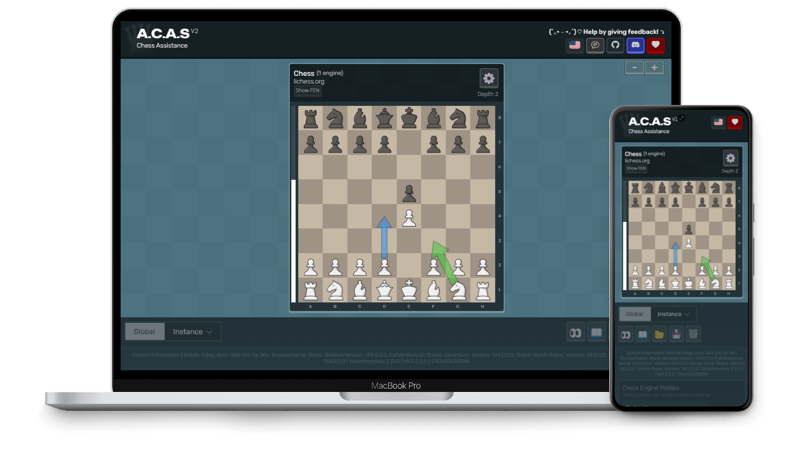

# A.C.A.S (Advanced Chess Assistance System)

> [!WARNING]
> A.C.A.S is currently in development. Expect bugs, especially on variants.

A.C.A.S (Advanced Chess Assistance System) is an open-source chess assistant (**not a chess cheat**), designed to help you make better moves using a chess engine. Just install the userscript, open the A.C.A.S GUI, and you're ready to go. No downloads necessary!

> [!CAUTION]
> The use of A.C.A.S may violate the rules and lead to disqualification or banning from tournaments and online platforms. A.C.A.S is meant to be used as a real-time learning tool. Remember, struggling at chess doesn't mean you're unintelligent... it's not an IQ test, just a board game. And even IQ tests only measure certain aspects of your abilities. Use A.C.A.S fairly, be kind to other players.

| [▶️ Open A.C.A.S](https://psyyke.github.io/A.C.A.S/) | [⬇️ Install (GreasyFork)](https://greasyfork.org/en/scripts/459137-a-c-a-s-advanced-chess-assistance-system)  | [💬 Discuss With Community](https://hakorr.github.io/Userscripts/community/invite)
|-------|-------|-------|

* Many built in WebAssembly engines (faster than JS)
* External engines (via an installable localhost server)
* Supports top chess sites (chess.com, lichess.org, etc.)
* Multiple suggestions, arrows, variants, fonts
* Multi-engine support, each with own settings
* Ability to modify any engine UCI options (e.g. ELO, depth, multiPV, skill)
* Visual board metrics (safe, contested, enemy squares, captured pieces)
* Move feedback and opponent predictions
* Render directly on external boards (or stay hidden via ghost mode)
* Audio TTS suggestions with adjustable speed
* Floating panel for stability and faster calculation
* Customizable themes (colors, fonts, textures)
* Chess variants supported (chess960, Fairy Stockfish variants)
* Translated into 30+ languages
* No anti-features on userscript

Used Libraries ❤️

| Library | Description | License |
|--------|------------|---------|
| [Fairy Stockfish WASM](https://github.com/fairy-stockfish/fairy-stockfish.wasm) | Chess engine (variants) | GPL-3.0 |
| [Stockfish WASM](https://github.com/nmrugg/stockfish.js/) | Chess engine (main engine) | GPL-3.0 |
| [ZeroFish](https://github.com/schlawg/zerofish) | WASM port of Lc0 + Stockfish | GPL-3.0 |
| [Maia-Chess](https://github.com/CSSLab/maia-chess) | Human-like NN weights | GPL-3.0 |
| [Maia-Platform-Frontend](https://github.com/CSSLab/maia-platform-frontend) | Maia 2 engine source | MIT |
| [Lozza](https://github.com/op12no2/lozza) | Additional chess engine | MIT |
| [COI-Serviceworker](https://github.com/gzuidhof/coi-serviceworker) | Enables WASM on GitHub Pages | MIT |
| [ChessgroundX](https://github.com/gbtami/chessgroundx) | Chessboard UI (modified) | GPL-3.0 |
| [FileSaver](http://purl.eligrey.com/github/FileSaver.js) | Save config files | MIT |
| [bodymovin (lottie-web)](https://github.com/airbnb/lottie-web) | SVG animations | MIT |
| [chess.js](https://github.com/jhlywa/chess.js) | Game logic (Maia 2) | BSD-2-Clause |
| [onnxruntime-web](https://github.com/Microsoft/onnxruntime) | Run ML models in browser | MIT |
| [Klaro!](https://github.com/klaro-org/klaro-js) | Cookie consent manager | MIT |
| [SnapDOM](https://github.com/zumerlab/snapdom) | DOM → image screenshots | MIT |
| [UniversalBoardDrawer](https://github.com/Hakorr/UniversalBoardDrawer) | Draw arrows on boards | MIT |
| [CommLink](https://github.com/AugmentedWeb/CommLink) | Cross-window communication | MIT |
| [Bootstrap Icons](https://getbootstrap.com/) | Icon set | MIT |
| [Mona Sans](https://github.com/github/mona-sans) | Font (GitHub) | SIL Open Font License |
| [Rubik](https://fonts.google.com/specimen/Rubik) | Sans-serif font | SIL Open Font License |
| [IBM Plex Sans](https://github.com/IBM/plex) | IBM typeface | SIL Open Font License |
| [ws](https://github.com/websockets/ws) | WebSocket server library | MIT |
| [Electron](https://www.electronjs.org/) | Desktop app framework | MIT |

There might be more, please let us know if anything is missing, thank you!

If you're having issues, please visit the [troubleshoot](https://psyyke.github.io/A.C.A.S/troubleshoot/) page.
Developers can visit the [development](https://psyyke.github.io/A.C.A.S/development/) page.

| A.C.A.S (Tab #1)    | Chess Website (Tab #2)  |
|----------------------|----------------------|
|  |  |
| The engine runs on a completely different tab than the chess game page, completely isolated from it. The site cannot block the usage of A.C.A.S. | A.C.A.S sends move data via [CommLink](https://github.com/AugmentedWeb/CommLink) and the userscript displays the data on the board using [UniversalBoardDrawer](https://github.com/Hakorr/UniversalBoardDrawer). (*If "Display Moves On External Site" setting is activated!*) |

