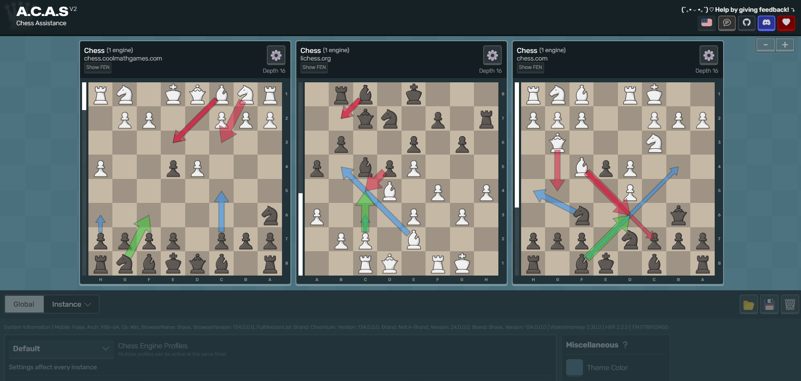

# A.C.A.S (Advanced Chess Assistance System)

!> A.C.A.S is currently in development. Expect bugs, especially on variants.

A.C.A.S is an **Advanced Chess Assistance System** which helps you make better moves with the help of a chess engine. Just install the userscript, open the A.C.A.S GUI and you're good to go! No downloading needed.

* No anti-features on userscript (*e.g. ads and tracking*)
* WebAssembly chess engine (faster than regular JavaScript engines)
* Supports the most popular chess game sites (*e.g. chess.com, lichess.org*)
* Supports multiple move suggestions, move arrow markings, chess variants & fonts
* Impossible to detect directly (well, you can never be sure, so let's say it's *almost* impossible)
* Translated to 30+ languages

!> Please be advised that the use of A.C.A.S may violate the rules and lead to disqualification or banning from tournaments and online platforms. The developers of A.C.A.S and related systems will NOT be held accountable for any consequences resulting from its use. We strongly advise to use A.C.A.S only in a controlled environment ethically.

| <a href="../">▶️ Open A.C.A.S</a> | [⬇️ Install (GreasyFork)](https://greasyfork.org/en/scripts/459137-a-c-a-s-advanced-chess-assistance-system) | <a href="../acas.user.js">⬇️ Download (Direct)</a> | [💬 Discuss With Community](https://hakorr.github.io/Userscripts/community/invite)
|-------|-------|-------|-------|

## Why should you use A.C.A.S?

First of all, it's **completely free** and **open source**. A.C.A.S gives you real-time chess support while you play, offering instant feedback and move suggestions. Instead of waiting until after the game to analyze mistakes, you get live insights to help you make better decisions in the moment. Whether you're working through a tough middlegame or deciding on your next move, A.C.A.S runs in the background, showing strong options without interrupting your flow.

Having real-time analysis means you can adjust your strategy as the game unfolds. The system helps highlight good moves and key ideas, making it easier to navigate tricky positions. Whether you're looking to improve over time or just want some extra guidance during a match, A.C.A.S gives you that extra bit of support when you need it.

## Contact

Discussion about A.C.A.S can be had on the [Userscript Hub](https://hakorr.github.io/Userscripts/community/invite) Discord server.

---

[A.C.A.S V1](https://github.com/Hakorr/Userscripts/tree/main/Other/A.C.A.S) is no longer updated, but feel free to use it if it still works. <a href="../privacy/">Privacy Policy</a>.