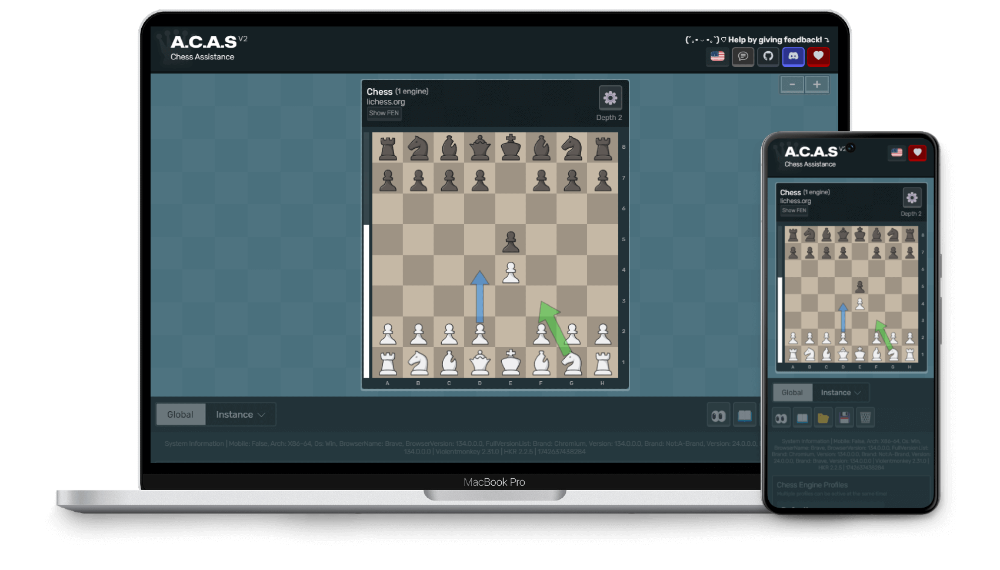

# A.C.A.S (Chess Assistance)

!> A.C.A.S is currently in development. Expect bugs, especially on variants.

A.C.A.S (Advanced Chess Assistance System) is an open-source chess assistant (not a chess cheat), designed to help you make better moves using a chess engine. Just install the userscript, open the A.C.A.S GUI, and you're ready to go—no downloads necessary!

* **Completely free** and **open source**! (Licensed with GPLv3 💖)
* No anti-features on userscript (*e.g. ads and tracking*)
* WebAssembly chess engine (faster than regular JavaScript engines)
* Supports the most popular chess game sites (*e.g. chess.com, lichess.org*)
* Supports multiple move suggestions, move arrow markings, chess variants & fonts
* Translated to 30+ languages

!> Please be advised that the use of A.C.A.S may violate the rules and lead to disqualification or banning from tournaments and online platforms. The developers of A.C.A.S and related systems will NOT be held accountable for any consequences resulting from its use. We strongly advise to use A.C.A.S only in a controlled environment ethically.

| <a href="app">▶️ Open A.C.A.S</a> | [⬇️ Install (GreasyFork)](https://greasyfork.org/en/scripts/459137-a-c-a-s-advanced-chess-assistance-system) | <a href="acas.user.js">⬇️ Download (Direct)</a> | [💬 Discuss With Community](https://hakorr.github.io/Userscripts/community/invite)
|-------|-------|-------|-------|

## Hindsight is Overrated

You know that feeling when you finish a game, check the analysis, and realize you’re complete dogsht* at chess? Like nah bro, what was that, how is 9 missed wins even possible?? I should just quit, pack it up, and never play again... if GothamChess sees my match, his next video wouldn't be from his home but a damn hospital bed... Nahhh 😭🙏

Tell you what. No subscriptions, no paywalls—just a ridiculously useful chess tool that works right on your favorite sites. That's what A.C.A.S is. Whether you're grinding puzzles, playing bullet, or trying to break 2000 Elo, A.C.A.S overlays insights directly on the board. It’s lightweight, it’s fast, and it doesn’t get in your way. Just install it, keep the GUI open, and learn how to play better. Oh yeah and it works on literally all of your devices that has a modern browser, including your little phone, everything processed locally!

Ready to begin? <a href="#/docs/installation">Install now</a>!

---

[A.C.A.S V1](https://github.com/Hakorr/Userscripts/tree/main/Other/A.C.A.S) is no longer updated, but feel free to use it if it still works. <a href="privacy/">Privacy Policy</a>.

*Discussion about A.C.A.S can be had on the [Userscript Hub](https://hakorr.github.io/Userscripts/community/invite) Discord server.*